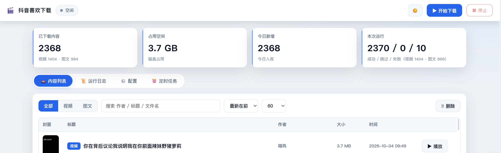
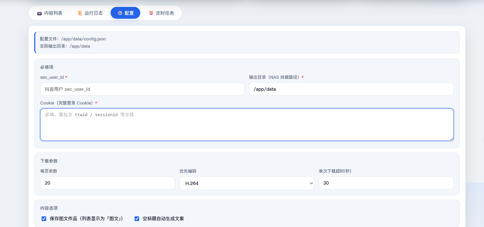

# 抖音「喜欢视频」批量下载 · Web 面板

把抖音账号**已点赞的全部视频**（含图文作品）批量拉到本地，按「作者/作品」自动分目录，支持增量续传、定时任务、批量删除。

* **纯 Python 标准库**，不需要 `pip install` 任何东西
* 自带 **Web 面板**（深色/浅色），浏览器里点点就行，也能挂 Docker 长期运行
* 飞牛 fnOS / NAS 已验证可一键部署（见 [DEPLOY-fnOS.md](DEPLOY-fnOS.md)）

## 免责声明

> **本项目仅供个人学习、家庭备份与自用，禁止用于任何商业用途或批量分发。**

* 本工具仅供**个人学习与技术研究**使用，使用者须自行承担全部法律与伦理责任。
* 请**严格遵守抖音（及相关内容平台）的用户协议、服务条款与著作权规定**。
* 抓取到的视频、图文作品、封面等**著作权均归原作者与平台所有**，本项目不主张任何权利，
  仅在你已拥有合法访问权限的前提下帮你把**自己已点赞的内容**整理到本地。
* **禁止**将本工具或抓取结果用于转载、传播、售卖、二次分发或任何牟利用途。
* 使用本工具造成的账号封禁、限流、版权投诉、法律纠纷等一切后果，**由使用者自行承担**，
  与本项目作者无关。
* 若你是作品的著作权人且认为自己的内容被不当使用，请通过 GitHub Issues 联系，
  我会第一时间配合处理。

---

## 来源与致谢

本工具诞生于 **[dysync.net](https://github.com/jianzhichu/dysync.net)**（抖音同步工具「抖小云」）项目，
在其基础上以 **Python** 技术栈重新实现了「抖音喜欢视频批量下载 + Web 面板」这一能力。
**特此向原作者致谢。**

| | |
|---|---|
| 上游项目 | [jianzhichu/dysync.net](https://github.com/jianzhichu/dysync.net) |
| 原作者 | 19173173892 |
| 上游技术栈 | .NET Core + Vue |
| 本工具技术栈 | 纯 Python 标准库 + 原生 Web 面板 |
| 上游许可证 | MIT License, Copyright (c) 2025 19173173892 |

上游采用 MIT 协议，本工具同样以 **MIT** 发布，并完整保留上游的原始版权声明
（见 [LICENSE](LICENSE)）。本工具与上游是**两个独立项目**，代码实现不同，
仅在功能思路与抖音接口经验上承袭。

如认为本声明与实际情况不符，请通过 GitHub Issues 联系更正。

---

## 效果图

### 内容列表 —— 增量统计 / 搜索筛选 / 批量管理



顶部实时显示已下载内容、占用空间、今日新增、本次运行成功/跳过/失败；
列表支持「全部 / 视频 / 图文」筛选、按作者·标题·文件名搜索、按最新/大小/时长排序，
勾选后可批量删除（删完可再下载）。

### 配置 —— 全部参数都在网页上改



输出目录、Cookie、下载参数、内容选项都在这一页；
`Cookie` 填完整浏览器 Cookie（需包含 `ttwid` / `sessionid` 等字段），
保存后点右上角「开始下载」即可。

---

## 功能

| 分类 | 能力 |
|---|---|
| **抓取** | 批量拉取已点赞视频（分页自动翻页）· 支持图文作品（图片 + 文案）· 自动补齐 `ttwid` |
| **增量** | 断点续传（`.part` 临时文件）· 已下载自动跳过（按作品 ID 记录）· 手动触发重新扫描 |
| **整理** | 按「作者 / 作品」两级目录 · **自动去掉文件名里的数字前缀** · 旧版本目录自动改名迁移 |
| **命名** | 默认清理标题里的数字与符号 · 无标题作品自动用文案命名 |
| **定时** | 设置时段 + 重复星期，到点**自动开始 / 自动停止** |
| **管理** | Web 面板增删改查 · **多选批量删除**（删完可再下载）· 「不再下载」名单 |
| **播放** | 面板内直接播放 · 进度/缓冲可视化 · **三种画面适配**（适应 / 裁切 / 高度） |
| **健壮** | CDN 节点不可达时 **6 秒内自动换源**并提示 · 单个视频失败不中断整轮 |

---

## 快速开始（Windows）

### 1. 准备两个值

| 需要什么 | 怎么拿 |
|---|---|
| **sec_user_id** | 抖音网页版 → 个人主页 → 地址栏 `?sec_uid=xxx` |
| **Cookie** | 浏览器 F12 → Network → 任一请求 → Headers → 复制完整 `Cookie` |

把 Cookie 存进 `cookie.txt`（一行），sec_user_id 存进 `sec_user_id.txt`，或直接在 Web 面板里填。

### 2. 运行

```bat
:: 先看看帮助
python dy_favorite_dl.py --help

:: 试跑一次（只打印不下载，强烈建议先跑这个）
python dy_favorite_dl.py --sec-user-id "MS4wLjABAAAA..." --cookie-file cookie.txt --dry-run

:: 正式下载
python dy_favorite_dl.py --sec-user-id "MS4wLjABAAAA..." --out "D:/抖音/喜欢" --cookie-file cookie.txt
```

### 3. 打开 Web 面板（更常用）

```bat
:: 默认只监听本机 127.0.0.1:8090
python webui.py --config config.json

:: 局域网内其他设备也能访问
python webui.py --host 0.0.0.0 --port 8090 --config config.json

:: 设置访问密码（强烈建议）
python webui.py --config config.json --password 你的密码
```

浏览器打开 <http://127.0.0.1:8090>，在「配置」里填 sec_user_id 和 Cookie，点「保存并开始」。

---

## Docker 部署（飞牛 fnOS / NAS）

见 **[DEPLOY-fnOS.md](DEPLOY-fnOS.md)**。要点：

```yaml
services:
  douyin-favorite-dl:
    build: .
    container_name: douyin-favorite-dl
    restart: unless-stopped
    ports:
      - "8090:8090"
    volumes:
      - "/你的媒体目录":/data          # 视频/配置/状态都存这里
      - /etc/localtime:/etc/localtime:ro
```

> ⚠️ 容器内网页里的**输出目录要填 `/data`**，不是宿主机路径 —— 填错的话文件会写进容器内部，在文件管理器里看不到。
> 这是最容易踩的坑，文档里有详细说明。

---

## 常用参数

| 参数 | 说明 |
|---|---|
| `--sec-user-id` | 你的 sec_user_id |
| `--cookie` / `--cookie-file` | Cookie（直接给或从文件读） |
| `--out` | 输出目录 |
| `--count` | 每页条数（默认 18） |
| `--codec` | 优先编码：`264`=H.264（兼容性最好）、`265`=H.265（体积小） |
| `--images` | 同时下载图文作品 |
| `--dry-run` | **只打印计划，不下载** |
| `--no-pretty-names` | 关闭"去数字"命名整理 |
| `--no-cover` / `--no-avatar` | 不下载封面图 / 头像 |
| `--min-interval` `--max-interval` | 单个视频下载间隔（秒），默认随机 1~4 |
| `--page-delay-min` `--page-delay-max` | 翻页延迟（秒），默认随机 1~9 |
| `--max-videos` `--max-pages` | 本轮最多下载多少视频 / 翻多少页（0 = 不限） |
| `--resume` / `--no-resume` | 断点续传（默认开） |

---

## 配置文件

复制 `config.example.json` 为 `config.json` 后按需修改：

```jsonc
{
  "sec_user_id": "MS4wLjABAAAA...",
  "cookie": "sessionid=...; ttwid=...",
  "out": "D:/抖音/喜欢",
  "codec": 264,
  "images": true,
  "pretty_names": true,
  "password": "",
  "schedule_enabled": true,
  "schedule": [
    { "id": "01", "label": "凌晨全量", "start": "02:00", "end": "06:00",
      "days": [0,1,2,3,4,5,6], "on_start": true, "on_end": true }
  ]
}
```

`config.json` 已被 `.gitignore` 排除，**不会误提交**。

---

## 安全须知

* **Cookie 等同于登录态。** 不要提交到 git、不要发到群里、不要截图分享。
* Web 面板**默认只监听 127.0.0.1**；要用局域网访问请显式加 `--host 0.0.0.0`，并**务必设置 `--password`**。
* Cookie 会过期，失效后重新复制一次即可。

---

## 开发

```bash
# 跑回归测试（159 项，全部用本地 mock，不联网）
python _regression.py

# 无 SDK 环境下的静态自检（括号配对 / 字符串截断）
python ../tools/quick_check.py
```

代码审查记录见 [CODE_REVIEW.md](CODE_REVIEW.md)。

---

## 许可

仅供个人学习自用。代码可自由阅读修改；**请勿用于商业用途或批量分发**。
